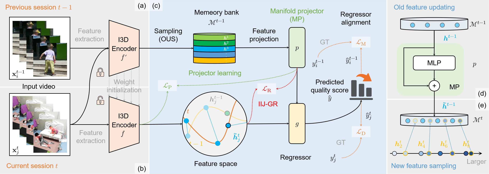

<div align="center">
  <div>
    <h1>
        MAGR: Manifold-Aligned Graph Regularization for Continual Action Quality Assessment
    </h1>
  </div>
  <div>
      Kanglei Zhou &emsp; 
      <a href='https://lywang3081.github.io/'>Liyuan Wang</a>  &emsp; 
      <a href='https://indussky8.github.io/'>Xingxing Zhang</a> &emsp; 
      <a href='http://hubertshum.com/'>Hubert P. H. Shum</a> <br/>
      <a href='https://frederickli.webspace.durham.ac.uk/'>Frederick W. B. Li &emsp; 
      <a href='https://baike.baidu.com/item/%E6%9D%8E%E5%BB%BA%E5%9B%BD/62860598?fr=ge_ala'>Jianguo Li</a>  &emsp; 
      <a href='https://orcid.org/0000-0001-6351-2538'>Xiaohui Liang</a>
  </div>
  <br/>
  <div>
  ECCV 2024 Oral Presentation > 
  <a href='./supp/MAGR-poster.pdf'> Poster </a> |
  <a href='./supp/MAGR-slides.pdf'> Slides </a> |
  <a href='https://www.youtube.com/watch?v=Llyiw-CpOew'> Video </a>
  </div>
  <br/>
</div>

This repository contains the implementation of MAGR, a novel approach designed for Continual Action Quality Assessment (CAQA). MAGR leverages Manifold Projector (MP) and Intra-Inter-Joint Graph Regularization (IIJ-GR) to address the challenges of feature deviation and regressor confusion across incremental sessions. The method aims to adapt to real-world complexities while safeguarding user privacy.



## Requirement

- torch==1.12.0
- torchvision==0.13.0
- torchvideotransforms
- tqdm
- numpy
- scipy
- quadprog

## Usage

### Install dependencies:

```bash
pip install -r requirements.txt
```

### Preparing datasets:

To get started with the experiments, follow the steps below to prepare the datasets:

#### MTL-AQA

1. Download the MTL-AQA dataset from the [MTL-AQA repository](https://github.com/ParitoshParmar/MTL-AQA).
2. Organize the dataset in the following structure:

```
$DATASET_ROOT
├── MTL-AQA/
    ├── new
        ├── 01
        ...
        └── 26
    ├── info
        ├── final_annotations_dict_with_dive_number
        ├── test_split_0.pkl
        └── train_split_0.pkl
    └── model_rgb.pth
```

#### UNLV-Dive

1. Download the AQA-7 dataset:

```
mkdir AQA-Seven & cd AQA-Seven
wget http://rtis.oit.unlv.edu/datasets/AQA-7.zip
unzip AQA-7.zip
```

2. Organize the dataset as follows:

```
$DATASET_ROOT
├── Seven/
    ├── diving-out
        ├── 001
            ├── img_00001.jpg
            ...
        ...
        └── 370
    ├── gym_vault-out
        ├── 001
            ├── img_00001.jpg
            ...
    ...

    └── Split_4
        ├── split_4_test_list.mat
        └── split_4_train_list.mat
```

#### JDM-MSA

Contact the corresponding author of [the JDM-MSA paper](https://ieeexplore.ieee.org/document/10049714) to obtain access to the dataset. You may need to complete a form before using this dataset for academic research.

### Pre-trained model:

Please download [the pre-trained I3D model](https://github.com/hassony2/kinetics_i3d_pytorch/tree/master/model) and then put it to `weights/model_rgb.pth`.

### Training from scratch:

We provide for training our model in both distributed and dataparallel modes. Here's a breakdown of each command:

1. In Distributed Data Parallel (DDP) mode:

```bash
torchrun \
	--nproc_per_node 2 --master_port 29505 main.py \
	--config ./configs/{config file name}.yaml \
	--model {model name: joint/adam/fea_gr} \
	--dataset {dataset name: class-mtl/class-aqa/class-jdm} \
	--batch_size 5 --minibatch_size 3 --n_tasks 5 --n_epochs 50 \
    --fewshot True --buffer_size 50 \
    --gpus 0 1
```

2. In Data Parallel (DP) mode

```bash
python main.py \
	--config ./configs/{config file name}.yaml \
	--model {model name: joint/adam/fea_gr} \
	--dataset {dataset name: class-mtl/class-aqa/class-jdm} \
	--batch_size 5 --minibatch_size 3 --n_tasks 5 --n_epochs 50 \
    --fewshot True --buffer_size 50 \
    --gpus 0 1
```

**Note:** We highly recommend using the DDP mode for training, as we have not tested the effectiveness of the DP mode.

### Testing:

If you want to perform testing using the same configurations as training but with the addition of the `--phase test` option.

```bash
torchrun \
	--nproc_per_node 2 --master_port 29503 main.py \
	--config ./configs/mtl.yaml \
	--model fea_gr --dataset class-mtl \
	--batch_size 5 --minibatch_size 3 \
	--n_tasks 5 --n_epochs 50 --gpus {gpu id} \
	--base_pretrain True --fewshot True \
	--buffer_size 50 --phase test \
    --exp_name {exp name}
```

### Example:

This repository provides an example for training and testing. The logs for this example can be found in the directory `outputs/ubuntu-fscl/class-mtl/fewshot_from_scratch`. This model is trained from scratch, and logs are located in `outputs/ubuntu-fscl/class-mtl/fewshot_from_scratch/logs/train-20250510-132848.log` and `outputs/ubuntu-fscl/class-mtl/fewshot_from_scratch/logs/test-20250510-183020.log`.

#### Explanation of [Training Log](outputs/ubuntu-fscl/class-mtl/fewshot_from_scratch/logs/train-20250510-132848.log)

The last row of "Rho (overall)" in the log is considered the overall Spearman’s Rank Correlation Coefficient (SRCC, denoted as`rho_avg` in our paper). Since SRCC is sensitive to sample size, instead of averaging each session's coefficient, all seen testing samples are accumulated to compute an overall correlation coefficient, which serves as the primary metric. In addition, `rho_aft` in the log represents the "forgetting" metric, while `rho_fwt` corresponds to the "fwt" metric.

**Note:** The evaluation results may slightly differ from the testing results due to the use of the reparameterization trick.

#### Practical Tip

Training using a robust base session model with `--base_pretrain True` allows you to reuse these weights for further experiments, significantly reducing training time. To utilize this, place the base model in the directory `weights/{class/domain}-{mtl/fd}{number_of_tasks}`. For example: `weights/class-mtl05.pth`.

## Acknowledgements

This repository is based on [mammoth](https://github.com/aimagelab/mammoth), many thanks.

If you have any specific questions or if there's anything else you'd like assistance with regarding the code, feel free to let us know.
